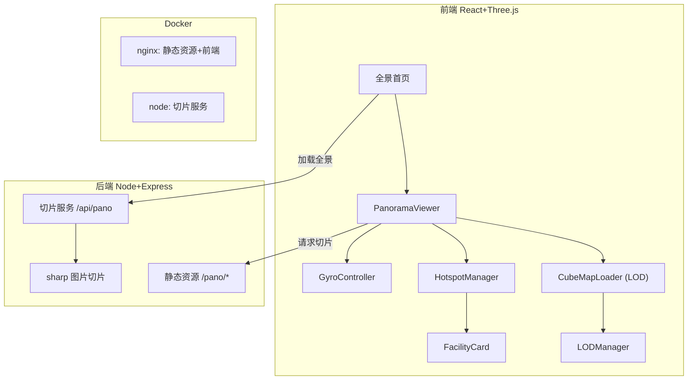
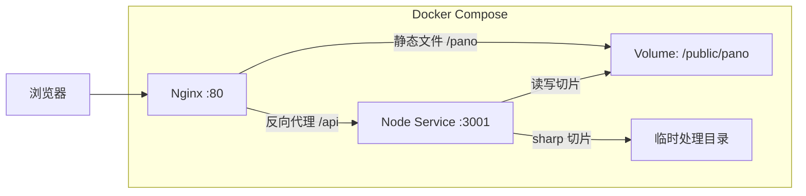
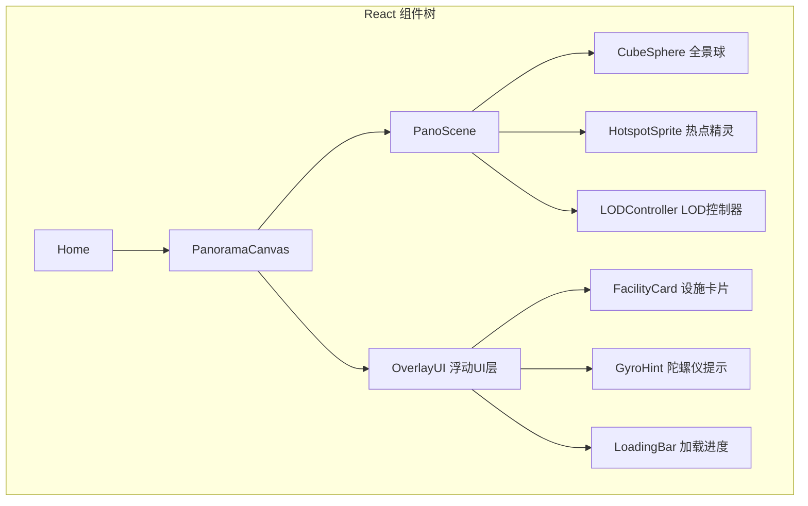
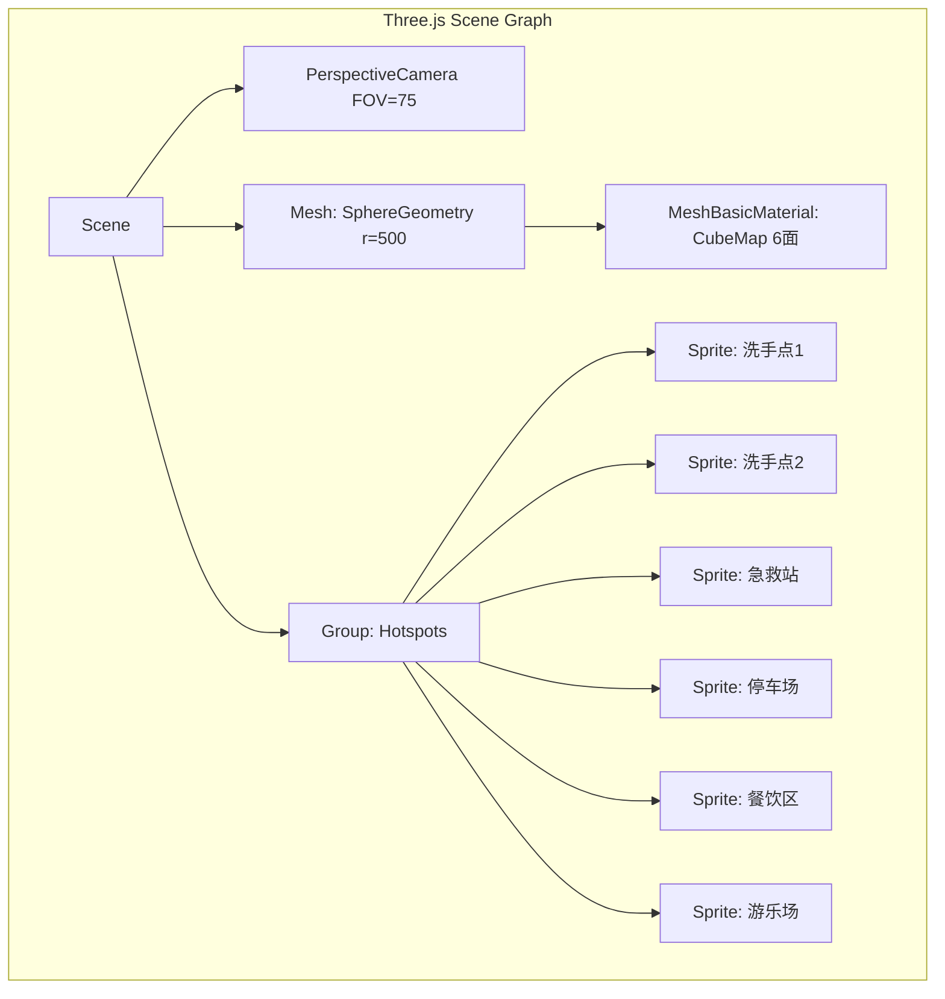

## 1. 架构设计



## 2. 技术说明

- **前端**：React@18 + Three.js + @react-three/fiber + @react-three/drei + TailwindCSS@3 + Vite
- **初始化工具**：已有 Vite 项目
- **后端**：Express@4 + sharp（图片切片）
- **数据库**：无，热点数据存储在 meta.json 静态文件中
- **部署**：Docker Compose（nginx 静态资源 + Node 切片服务）

## 3. 路由定义

| 路由 | 用途 |
|------|------|
| `/` | 全景首页，主交互界面 |
| `/api/pano/:sceneId/meta` | 获取场景热点数据与元信息 |
| `/api/pano/:sceneId/slice` | 上传原始全景图并触发切片 |
| `/pano/:sceneId/:face/:lod.jpg` | 静态切片资源 |

## 4. API 定义

```typescript
interface HotspotData {
  id: string
  position: [number, number, number]
  type: "restroom" | "firstaid" | "parking" | "playground" | "campsite" | "food"
  name: string
  walkMinutes: number
  description: string
}

interface SceneMeta {
  sceneId: string
  name: string
  hotspots: HotspotData[]
  maxLod: number
  faces: ("px" | "nx" | "py" | "ny" | "pz" | "nz")[]
}

interface SliceRequest {
  sceneId: string
  imageUrl: string
}

interface SliceResponse {
  sceneId: string
  faces: string[]
  lods: number[]
  status: "processing" | "done"
}
```

## 5. 服务架构图



## 6. 核心组件架构



## 7. LOD 策略

1. **首屏加载**：仅请求正面(pz)、左(nx)、右(px) 三面的 LOD0 (512px)，约 225KB
2. **视角变化**：LODController 监听相机朝向，计算当前可见面与相邻面
3. **渐进升级**：可见面先加载 LOD0，3 秒后自动升级到 LOD1 (1024px)，空闲时升级 LOD2 (2048px)
4. **内存管理**：背面降级为 LOD0 或卸载，最多同时持有 3 面 LOD2

## 8. 场景图


